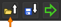
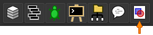
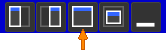

# Voronoi-Diagramm-Generator
Dieses Programm generiert Voronoi-Diagramme für zufällige Repräsentationspunkte und Farben unter Verwendung von Minkowski-Distanzen in TScript https://tglas.github.io/tscript/.

Dabei können Bilder in Form von Bitmaps oder zufällige Farben als Basis für die Farbe der einzelnen Voronoi-Zellen genutzt werden. 
Die Repräsentationspunkte können allgemein als Gitter oder zufällig generiert werden. Für das gegebene Beispielbild der Grapefruit sind zwei weitere Arten der Generierung möglich.
Zunächst wird ein gröberes Gitter aus weniger Repräsentationspunkten generiert. Danach werden entweder zufällige Punkte im Bereich der Grapefruit oder genau außerhalb davon geplottet.

# Ausführung
1. Herunterladen des [Voronoi-Generators](voronoiGenerator.tscript).
2. TScript unter https://tglas.github.io/tscript/ öffnen und die Datei unter

   

  hochladen. Das relevante Icon wird immer durch den orangenen Pfeil angezeigt.

3. Um die Diagramme anzeigen zu lassen muss der Bereich 'Canvas' aus der Programmleiste geöffnet werden.

  

  Je nach Größe und Platzierung muss der Canvas maximiert werden, um das Voronoi-Diagramm vollständig anzuzeigen. Dazu lassen sich rechts oben im Canvas-Bereich, der nach Schritt 3. Teil des Arbeitsbereichs ist, verschiedene Positionierungen für den Canvas auswählen. Für die Maximierung muss

  

  ausgewählt werden. Das Programm kann nun ausgeführt werden.
